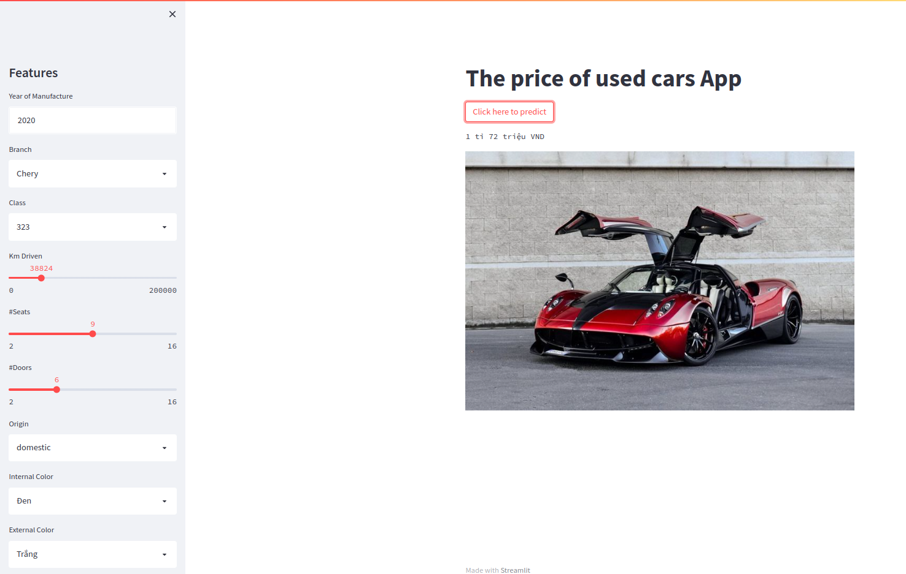

# App predict Price of old Car

## Command useful

```
# Create image
make build_image

# run container
make run_server
```

Open new terminal and run

```
make app
```

## Docker-compose for App

```
# Buiding Docker file
sudo docker build -t mlops_api:latest .
```

## Some Resulst


